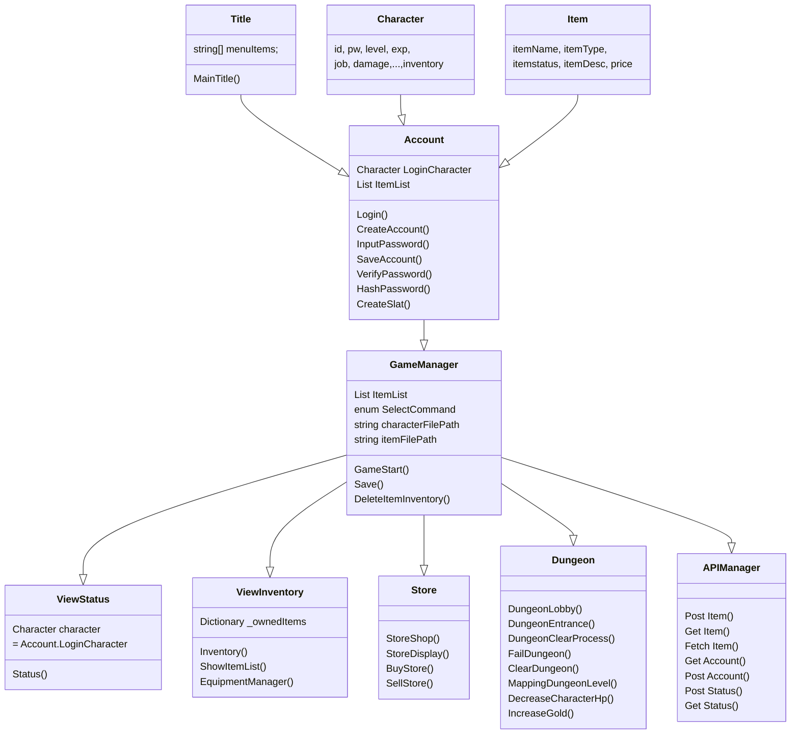

Dungeon RPG
--

### 프로젝트 구성

|목록|내용|
|:--|:--|
|타이틀|Dungeon RPG|
|기간|23.11.09 ~ 23.11.11|
|개발 인원|1 명 |
|IDE|Rider|
|Devlop Env|Mac M1 Silcon|
|Language|C#|
|Redering|Rider Console|

### Class 구성

### 기능 구성

#### 1. 계정 생성 및 로그인
- Character 구성은 Json File을 사용
- 암호는 Argon2를 이용한 단방향 암호화
#### 2.  아이템 장착 및 해제
- 별도의 Item Class 에서 Json 형태의 아이템 리스트 관리
- Character의 Inventory Class 에서 Dictionary의 Key Value로 아이템 장착 관리
#### 3. 던전 탐사 기능
- 던전 로비에서 케릭터 상태 확인 가능
- 던전 요구 방어도 이하 입장시 40% 확률로 실패하여 체력 감소
- 요구 던전 클리어 횟수 도달 시 레벨업 기능 
- 레벨업 시 능력치 상승
#### 4. 회복 기능
- Gold 지불 시 회복하여 HP 회복
#### 5. 상점 기능
- 구매 및 판매 기능 구현
#### 6. 온라인 채팅 기능 (구현중)
- Socket 사용하여 온라인 채팅 기능 구현

